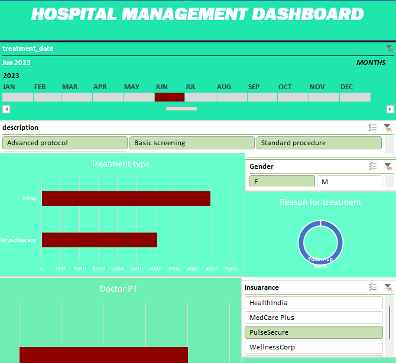

# Hospital Operations & Patient Analytics Dashboard 🏥
An interactive Excel dashboard analyzing hospital KPIs including patient demographics, treatment costs, and departmental performance.

## Project Overview
This project features a comprehensive **Advanced Excel Dashboard** designed to monitor hospital operations. It integrates multiple data sources (Patients, Doctors, Treatments, and Billing) to provide a 360-degree view of hospital performance.

## Key KPIs Tracked
* **Revenue Metrics:** Total billing amount and costs by treatment type (Physiotherapy, MRI, ECG, etc.).
* **Patient Analytics:** Patient distribution by Gender, Insurance Provider (e.g., WellnessCorp, MedCare Plus), and Age.
* **Operational Efficiency:** Appointment statuses (Completed, No-show, Scheduled, Cancelled).
* **Staff Performance:** Analysis of doctor specializations and patient loads.

## Technical Skills Demonstrated
* **Data Modeling:** Combined multiple relational datasets using Power Pivot / VLOOKUP.
* **Data Transformation:** Cleaned and formatted currency (KES) and date fields.
* **Advanced Visualizations:** Pivot Tables, Slicers for interactivity, and custom charting.
* **Pivot Table Aggregation:** Created summary reports for revenue and patient counts.

## Dashboard Preview

## Insights Found
1. **Revenue Drivers:** Identified high-cost treatments like MRI and Chemotherapy as primary revenue sources.
2. **Insurance Trends:** A significant portion of patients utilize 'WellnessCorp' and 'PulseSecure'.
3. **Appointment Compliance:** High cancellation and no-show rates in certain departments highlight areas for operational improvement.

## How to Use
1. Download the file in the `dashboard/` folder.
2. Open in Excel and ensure "Enable Content" is clicked for any interactive elements.
3. Use the Slicers to filter data by Doctor, Specialization, or Status.
